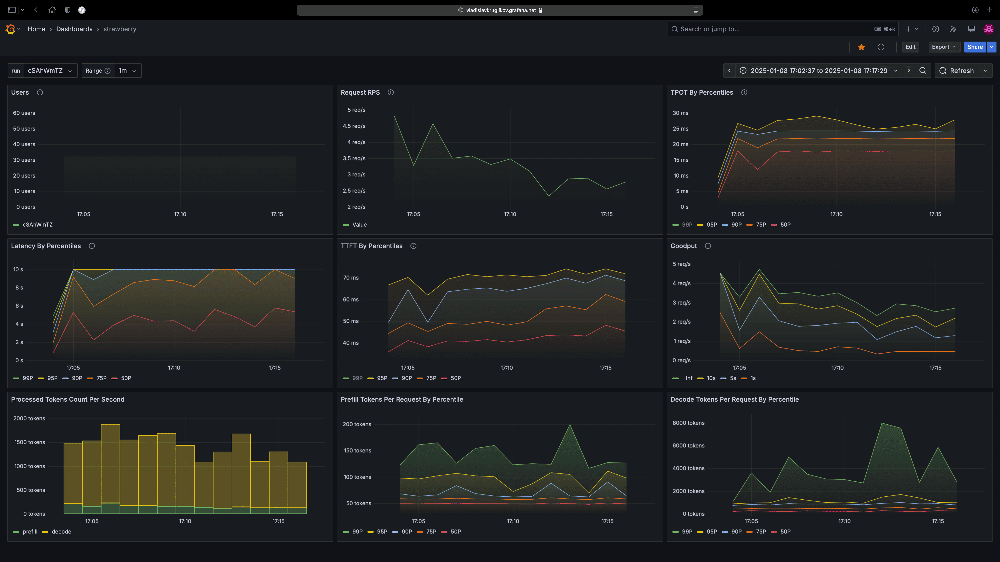

## 🍓 Strawberry

**Supports [vLLM](https://github.com/vllm-project/vllm), [SGLang](https://github.com/sgl-project/sglang), [TensorRT-LLM](https://github.com/NVIDIA/TensorRT-LLM), [TGI](https://github.com/huggingface/text-generation-inference), [LMDeploy](https://github.com/InternLM/lmdeploy), [OpenAI](http://openai.com) and any other Open AI compatible inference server. Check out [examples](./examples) folder**



Strawberry is a tool designed to facilitate benchmarking of large language model inference servers that implement 
OpenAI like chat completion APIs. It leverages Prometheus for metric collection and Grafana for visualization while 
custom code is utilized to send requests to the server. Strawberry provides an efficient and structured approach to
run benchmarks and store metrics in remote storage. It is highly flexible allowing integration with custom Prometheus
instances or Grafana setups for maintaining data privacy with minimal configuration changes. Users can utilize predefined
Grafana dashboard templates covering popular metrics or extend and customize these dashboards using the data collected during
benchmarking. Furthermore Strawberry allows users to define and record their own metrics for tailored analysis

Additionally this repository includes notes on metrics and various 
insights that may be valuable for individuals interested in benchmarking
large language models LLMs

The core concept behind Strawberry is its independence from any 
specific library or framework. Instead, it operates with the abstraction
provided by the OpenAI API. Any library or framework that implements the
OpenAI API such as **vLLM** or **SGLang** can be benchmarked with Strawberry
without requiring additional code or modifications. This approach ensures that 
Strawberry remains agnostic to the internals of the framework focusing solely
on the shared protocol defined by the OpenAI API for chat completions


## Attention

This is an early version of the tool that I aimed to release as 
quickly as possible. Significant enhancements and features are planned
for future updates. Below is a brief list of features I intend to implement

- Advanced data samplers for more efficient benchmarking
- A summary table showcasing benchmarks of popular models across various frameworks using this tool
- Comprehensive test coverage to ensure reliability and accuracy
- Enhanced user simulation with granular settings including the ability to handle multi turn interactions
- Configurable presets that can be version controlled for consistent benchmarking setups
- Synthetic load test dataset generation based on the distribution of your data

Feel free to suggest features you would like to see or contribute directly. You are also welcome to contact me directly; my contact information is available in my profile.

## 32+ Metrics

A comprehensive range of popular metrics is supported including

- **TTFT** Time to first token
- **TPOT** Time per output token
- **Total latency** Measured by percentiles
- **Goodput** Effective throughput of successful responses
- **Other metrics** Additional useful measurements
- **Extensibility** Easily add new custom metrics to suit specific needs

## Storage

Although this section may initially seem complex it only needs to be
completed once and can then be reused with any framework such as **vLLM** or **SGLang**

In this section you will set up a Grafana Cloud workspace with Cloud Prometheus to store
and visualize your benchmarking data. If you are unfamiliar with these technologies
they are widely used and learning them may prove beneficial for other applications as well

First create a [Grafana Cloud](https://grafana.com/products/cloud) account to store and
visualize load test results

Next configure a single file `prometheus.yaml` where you will input
information about the Grafana Cloud workspace you just created. A template
for this file is available in the repository

Start by setting up the remote write configuration. To find the necessary information about your workspace. Log in to your [Grafana Account](https://grafana.com/auth/sign-in). Select 
your Grafana Cloud Stack (most users will have a single stack) and click **Launch**. On the **Manage Your Stack** page
locate the Prometheus stack and click **Details**. Scroll down to the **Sending metrics with Prometheus** section to find the remote write 
configuration details for your workspace. Generate an API token by clicking **Generate now** on the same page

Update the `prometheus.yaml` file with the provided remote write configuration. You will also see a `targets` parameter in the file. This parameter specifies the URL that exposes metrics. For this setup you can leave it unchanged because the code when run in Docker is already configured to use the appropriate host and port

Next create a common Docker network to be used by all containers

```bash
docker network create strawberry
```

Finally start Prometheus using Docker

```bash
docker run \
  --name prometheus \
  --rm \
  --network strawberry \
  -v $(pwd)/prometheus.yaml:/etc/prometheus/prometheus.yaml \
  prom/prometheus \
  --config.file=/etc/prometheus/prometheus.yaml
```

## Server

Now start one of your OpenAI like inference web server

```bash
docker run \
  --gpus all \
  --rm \
  --name server \
  -v $(pwd)/models:/root/.cache/huggingface \
  --network strawberry \
  vllm/vllm-openai:v0.6.5 \
  --model Qwen/Qwen2.5-0.5B-Instruct \
  --gpu-memory-utilization 0.1
```

## Examples

Now you are ready to run 🍓strawberry and here are few examples of use cases

* [Benchmark Qwen/Qwen2.5-0.5B-Instruct with vLLM](./examples/benchmark_qwen_vllm.md)
* [Run prediction batch job using Qwen/Qwen2.5-0.5B-Instruct with SGLang with local output storage](./examples/batch_qwen_sglang.md)
* [Run preemprible prediction batch job using Qwen/Qwen2.5-0.5B-Instruct with TGI with aws S3 storage]()

And here are more examples for you to help you run some popular OpenAI compatible server

* [vllm](./examples/vllm.md)
* [sglang](./examples/sglang.md)
* [tgi](./examples/tgi.md)
* [tensorrtllm](./examples/tensorrtllm.md)
* [lmdeploy](./examples/lmdeploy.md)

## Plots

Now you are ready to visualize your results in Grafana. Grab [this](./grafana/dashboard.json) dashboard template and install it into your grafana template. Select source for data your cloud instance


## Notes

If you want you can build benchmark image from scrach you can do

```bash
docker build --tag strawberry .
```

## Frequently Asked Questions

For now it seems that proprietary large language models can help with that

## References

Great articles

* https://hao-ai-lab.github.io/blogs/distserve
* https://blog.ori.co/how-to-perform-a-cost-per-token-analysis-of-self-hosted-llms-dbrx-from-databricks

# Developers

Install pre commit before start
